### Asset Request Workflow – Procurement vs Finance

This document summarizes how the asset request lifecycle is split between **Procurement** and **Finance** segments, based on the current backend and frontend implementation.

#### Asset request lifecycle (end-to-end)

The flow below is the single end-to-end view. Owner role and main statuses are listed for each phase.

1. **Request** – End User submits → `SUBMITTED`
2. **Manager** – Manager approves/rejects → `MANAGER_APPROVED` / `MANAGER_REJECTED`
3. **IT** – IT approves/rejects → `IT_APPROVED` / `IT_REJECTED`
4. **Manager confirms IT** – → `MANAGER_CONFIRMED_IT`
5. **Inventory decision** – Allocate from stock (→ `USER_ACCEPTANCE_PENDING` / `IN_USE`) **or** no stock → `PROCUREMENT_REQUESTED`
6. **Procurement** – Create/upload PO, validate PO → `PO_UPLOADED` → `PO_VALIDATED` or reject → `PROCUREMENT_REJECTED`. Only **PROCUREMENT** role can upload/validate PO and confirm delivery.
7. **Finance** – Budget approve/reject when status is `PO_VALIDATED` → `FINANCE_APPROVED` / `FINANCE_REJECTED`. Only **FINANCE** role can approve/reject budget.
8. **Procurement (delivery)** – Confirm delivery after Finance approval → `QC_PENDING`, `procurement_finance_status = DELIVERED`
9. **QC** – Inventory/QC → `USER_ACCEPTANCE_PENDING` or `QC_FAILED`
10. **User acceptance** – Accept/reject → `FULFILLED`/`IN_USE` or `USER_REJECTED`/`CLOSED`

**BYOD path:** At Manager Confirms IT, the flow can branch to `BYOD_COMPLIANCE_CHECK` → `IN_USE` or `BYOD_REJECTED` (see state machine).

```mermaid
flowchart LR
  Request[Request] --> Manager[Manager]
  Manager --> IT[IT]
  IT --> MgrConfirmIT[Manager Confirms IT]
  MgrConfirmIT --> Inventory[Inventory]
  Inventory --> Procurement[Procurement PO]
  Procurement --> Finance[Finance]
  Finance --> ProcurementDelivery[Procurement Delivery]
  ProcurementDelivery --> QC[QC]
  QC --> UserAccept[User acceptance]
  UserAccept --> EndNode[FULFILLED or CLOSED]
```

#### Core spine: `AssetRequest`

- Single request record drives the workflow (`/asset-requests` API).
- Shared status field (e.g. `SUBMITTED`, `MANAGER_APPROVED`, `PROCUREMENT_REQUESTED`, `QC_PENDING`, `USER_ACCEPTANCE_PENDING`, `FULFILLED`).
- Additional field `procurement_finance_status` is used for the Procurement/Finance segment:
  - Values include: `PO_VALIDATED` (Procurement validated PO; Finance queue shows these), `PROCUREMENT_REJECTED`, `DELIVERED`, `APPROVED`/`FINANCE_APPROVED`, `FINANCE_REJECTED`, etc. (backend service mapping).

#### Segment ownership

- **Pre‑procurement segment (Manager / IT / Inventory)**
  - `SUBMITTED` → `MANAGER_APPROVED` / `MANAGER_REJECTED`
  - `IT_APPROVED` / `IT_REJECTED`
  - Inventory either:
    - Allocates from stock → `IN_USE` / `FULFILLED`, or
    - Marks **not available** → `PROCUREMENT_REQUESTED` (routes into Procurement segment).

- **Procurement segment**
  - Entry:
    - `status = PROCUREMENT_REQUESTED` (or mapped `PROCUREMENT_REQUIRED` in frontend), and
    - `currentOwnerRole = PROCUREMENT`.
  - Actions (see `AssetContext` procurement helpers):
    - `inventoryCheckNotAvailable` sets:
      - `status = PROCUREMENT_REQUESTED`
      - `currentOwnerRole = PROCUREMENT`
      - `procurementStage = 'AWAITING_DECISION'`
    - Procurement validate PO (approve):
      - Backend: `POST /asset-requests/{id}/procurement/approve`
      - Service sets `status = PO_VALIDATED`, `procurement_finance_status = 'PO_VALIDATED'` (no Finance call here).
      - Frontend maps to `procurementStage = 'PO_VALIDATED'`; `currentOwnerRole = FINANCE` (Finance queue).
    - `procurementReject`:
      - Backend: `POST /asset-requests/{id}/procurement/reject`
      - Sets `status` to a rejected variant and `procurement_finance_status = 'PROCUREMENT_REJECTED'`.
      - Ownership returns to `END_USER`.
    - `procurementUploadPO`:
      - Backend: `POST /upload/po/{request_id}` – attaches PO and extracted metadata.
      - Frontend reloads data; `procurementStage` reflects PO upload state.

- **Finance segment**
  - Entry:
    - Frontend Finance queue filters on `currentOwnerRole === 'FINANCE'` and status/stage indicating PO validated (e.g. `status === 'PO_VALIDATED'` or `procurementStage === 'PO_VALIDATED'`).
  - Actions:
    - `financeApprove`:
      - Backend: `POST /asset-requests/{id}/finance/approve` → `procurement_service.validate_finance_budget(..., "APPROVE")` sets `status = FINANCE_APPROVED`, `procurement_finance_status = APPROVED`.
      - Frontend: `procurementStage = 'FINANCE_APPROVED'`, `currentOwnerRole = PROCUREMENT` (handoff for delivery).
    - `financeReject`:
      - Backend: `POST /asset-requests/{id}/finance/reject` → `validate_finance_budget(..., "REJECT", reason=...)` sets `FINANCE_REJECTED`.
      - Frontend: `status = REJECTED`, `procurementStage = 'FINANCE_REJECTED'`, `currentOwnerRole = END_USER`.

- **Post‑finance procurement & inventory**
  - `procurementConfirmDelivery`:
    - Backend: `POST /asset-requests/{id}/procurement/confirm-delivery`
    - Sets:
      - `status = QC_PENDING`
      - `procurement_finance_status = 'DELIVERED'`
      - Creates `Asset` + `AssetInventory` records.
    - Frontend maps:
      - `status = 'QC_PENDING'`
      - `procurementStage = 'DELIVERED'`
      - `currentOwnerRole = ASSET_INVENTORY_MANAGER`.

- **QC and User acceptance**
  - QC (`/asset-requests/{id}/qc/perform`):
    - `QC_PENDING` → `USER_ACCEPTANCE_PENDING` (if passed) or `QC_FAILED`.
  - User acceptance (`/asset-requests/{id}/user/accept`):
    - `USER_ACCEPTANCE_PENDING` → `FULFILLED` / `IN_USE`.

#### Frontend mapping summary

- `AssetContext` derives:
  - `status` – from backend `status` with mapping (e.g. `SUBMITTED`/`PENDING` → `REQUESTED`, `PROCUREMENT_REQUESTED` → `PROCUREMENT_REQUIRED`, all *_REJECTED → `REJECTED`).
  - `procurementStage` – from `procurement_finance_status`:
    - `APPROVED` → `'FINANCE_APPROVED'`
    - null/empty → `null` (no default staging).
  - `currentOwnerRole` – via `deriveOwnerRole(status, assetType, procurementStage)`:
    - Inventory routing sets `PROCUREMENT` vs `FINANCE` vs `ASSET_INVENTORY_MANAGER` vs `END_USER`.

This state machine ensures:

- **Procurement** owns PO creation, vendor selection, and delivery confirmation.
- **Finance** owns budget approval/rejection and financial governance.
- Ownership is transferred using `currentOwnerRole` and `procurement_finance_status`, while the single request record remains the backbone of the workflow.

#### Notifications

- **Manager rejection** (`MANAGER_REJECTED`): requester is notified.
- **IT rejection** (`IT_REJECTED`): requester is notified.
- **Procurement rejection** (`PROCUREMENT_REJECTED` / `PO_REJECTED`): requester and **IT_MANAGEMENT** are notified.
- **Finance rejection** (`FINANCE_REJECTED`): requester, **IT_MANAGEMENT**, and **PROCUREMENT** are notified.
- **QC failure** (`QC_FAILED`): **PROCUREMENT** and **FINANCE** role users are notified.

